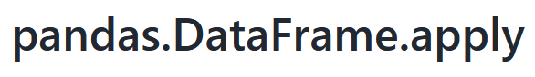
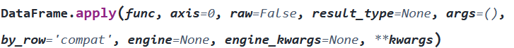
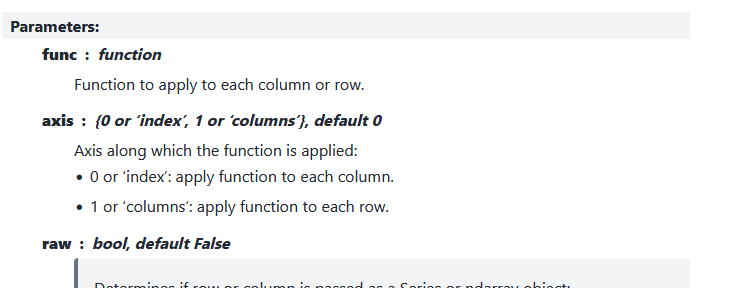
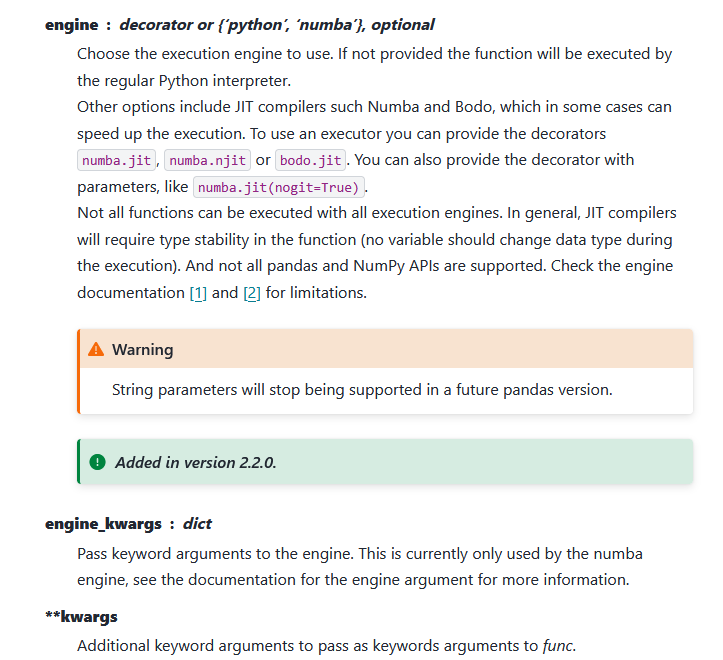
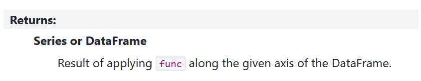

# Python behind-the-scenes: what data scientists should know

The goal of this session is touch on the important programming concepts that often get missed in research-oriented tutorials (e.g. the software carpentries).

Part of the problem is that it takes a lot less Python to *use* the popular modules (e.g. `pandas`, `numpy`, `matplotlib`) than to *develop* them. This is *the whole point*: the modules exist so that you don't need to be a developer.

However, when it comes to using them, the more you know about what's going on behind-the-scenes, the more you'll understand *why things break* and *why things work*. This is a skill you learn over time, but one that we'll hopefully build up a bit today.

Important concepts for researchers include

* Classes/Object-Oriented-Programming (OOP)/Custom Variables: What is a `DataFrame`? What is a `Figure` or `Axes` object? What's the difference between a function and a method?
* Vectorisation -> why pandas dataframes are more efficient than lists (spoiler: it's actually because of `numpy`)
* Module design. Why do some modules use submodules?

## What is Python?

::: {.callout-note}
# Group question

What is Python?
:::

The answer is not as obvious as you might think. There are three things you might call Python:

* The language
* The program
* The interpreter / IDE

It's best seen by example. Let's run a simple program,

```{python}
print("This is a simple program.")

one_plus_one = 1 + 1

print("1 + 1 =", one_plus_one)

if 1 + 1 == 2:
    print("All tests passed.")
else:
    print("Uh oh...")
```

What actually *happens* when you run it?

1. You (or your IDE) calls the program `python` with the input file `simple_program.py`.

:::{ .panel-tabset}

Even if you don't do this, your IDE does:

# Windows

```bash
python simple_program.py
```

# MacOS / Linux

```bash
python3 simple_program.py
```

:::

2. The program `python` *interprets* your 'Python' code for the computer, converting it into binary commands (1000101010...). It then *interprets* the binary output as something meaningful. This is why `python` is called the **interpreter**.

So far so good. But how does the interpreter know what to do? Is the interpreter written in Python too?

***No.***

For most people, their interpreter is written in [C](https://en.wikipedia.org/wiki/C_(programming_language)) and referred to as the [CPython](https://en.wikipedia.org/wiki/CPython) implementation. C is a *compiled* language, rather than an interpreted one. Before you run any C program, you must compile it into binary code *as a separate step*. This means it's not dynamic but is suitable for programs.

All this is to say that Python can mean a few things. Here, I'll stick to "Python" for the language and `python` for the program.

::: {.callout-note}
# Group activity

Find your Python interpreter / executable.

* On Windows, this is `python3.exe` 
* On Mac / Linux, this is `python`

Some places to look

* Miniconda installs it in a folder called `miniforge3`.
    * On Windows, try `C:\Users\your_username\AppData\Local\miniforge3`. You'll need to **unhide hidden folders**.
    * On Mac / Linux, try `/home/your_username/miniforge3/bin`
* Standalone Python installs it in `.../Python/bin` 

If you used Miniconda, go to the `envs` folder in `miniforge3`. You might find *another* interpreter! It's common to have many interpreters installed. Environment management can help mitigate side effects.

:::

So, **what is Python**?

The Wikipedia answer is

> Python is a high-level, general-purpose programming language that emphasizes code readability, simplicity, and ease-of-writing with the use of significant indentation, "plain English" naming, an extensive ("batteries-included") standard library, and garbage collection. Python supports multiple programming paradigms but with an emphasis on object-oriented programming and dynamic typing. 
> Source: [Wikipedia](https://en.wikipedia.org/wiki/Python_(programming_language))

Let's unpack this.

<!-- | Characteristic | Description | 
| --- | --- | 
| **High-level** | Relies on another language (e.g. C) to convert to binary. | 
| **General-purpose** | Used for software, research, data, machine learning, gaming, etc. | 
| **Code readability** etc. | Lots of whitespace, simple syntax, code reads what it does | 
| **Standard library** | There's a lot of useful built-in libraries | 
| **Garbage collection** | Automatic memory management | 
| **Object-oriented programming** | Custom variables/objects with built-in values and functions; **classes**. We'll talk more about this... |
| **Dynamic typing** | You don't have to specify or stick to variable types (`int`, `str` etc.) |

The most important one for us is **object-oriented programming**. It's an ... -->

## Unpacking a simple example

In our Python workshops we've been working with pandas DataFrames to manage data. We typically do something like

```{python}
import pandas as pd

df = pd.read_csv("data/gapminder_all.csv") 

df.head() 
```

We're going to study this example closely.

### `import pandas as pd`

In the first line, we import the module. Behind-the-scenes, Python searches certain (somewhat mysterious) locations on your computer for a folder called `pandas`.

::: {.callout-note}
# Group activity

Find the pandas module and open the `__init__.py` file.

1. Go to the location of your Python installation
    * If you're using an environment, go there
2. Find a folder called `pkgs` or `lib`
3. Dig a little for `pandas` (or something similar)
4. Keep digging until you find `__init__.py`
5. Open it

:::


The `__init__.py` file gets run when you `import` the module. It's usually full of other `import` statements to access the rest of the module and function/class definitions. We'll come back to this.

### `df = pd.read_csv("data/gapminder.csv")`

This is the simplest line.

* `df = ` assigns the output of the right hand side to the variable `df`.
* `pd.read_csv(...)` is a function *inside* the `pandas` module. The `.` means "look inside"

`pd.read_csv()` is a complicated function, but we can see its definition(s) explicitly---they're in the module. Go to `pandas/io/parsers/readers.py` and search for `def read_csv()`. That's the code that runs.


### `df.head()`

The *last* line, `df.head()` prints the first five rows in the dataframe `df`. There are three distinct elements:

* `df` -- the dataframe
* `.` -- the dot operator
* `head()` -- the function

:::{ .callout-note}
# Group question

What's the difference between

```python
head(df)
pd.head(df)
df.head()
```
:::

The main difference is where `head` lives. 

* `head(df)` assumes that `head` lives in the global namespace. This happens when
    * It's a built-in function
    * You define it yourself
    * You import it explicitly: `from some_module import head` (or `from some_module import headache as head`)
* `pd.head(df)` assumes that `head` lives in the `pandas` module, like `read_csv`.
* `df.head()` assumes that `head lives *inside the variable* `df`.

How can a function live *inside* a variable? Object-oriented programming.

## What is a dataframe?

::: {.callout-note}
# Group question

What is a `pandas` DataFrame?

:::

According to [pandas](https://pandas.pydata.org/pandas-docs/stable/reference/api/pandas.DataFrame.html)

> Two-dimensional, size-mutable, potentially heterogeneous tabular data.

In other words, a spreadsheet.

That answer might satisfy the data scientist but won't satisfy the computer scientist. One could instead answer

> A Python container of Series objects

We would need to define the Series too:

> A Python array of single-type (homogenous) data

where by *array* we mean 1D container (like a list).

This still doesn't really answer the question. What *is* it? Is it a list? A dictionary?

No, and no. It's a custom-made variable type, which *uses* lists but *is not* a list. The `pandas` developers have taken the nuts and bolts of Python to design their own variable.

However, there's an important ingredient which let's them do this *that we have not learnt yet*: the `class`. In essence, a `pandas` DataFrame is a `class`.

### Classes

In the Wikipedia definition before, we saw that 

> ... Python supports multiple programming paradigms but with an emphasis on object-oriented programming and dynamic typing. 

Classes enable object-oriented programming.

* A class is a general 'template', 'blueprint' or 'framework' for an object. 
* All Python objects are particular *instances* of general *classes*. 
* All instances of a class have the same features in common

The following image<sup>[source](https://en.wikipedia.org/wiki/Object-oriented_programming#/media/File:Oop-uml-class-example.svg)</sup>, is a schematic example of a class


This class, `Button`, has six variables (static) and four functions (dynamic). All instances of `Button` (e.g. `red_button`, `blue_button`) will have an `xposition` and a function `draw()`, but the actual values may differ. It's Platonic programming.

Let's code up the button class in Python. We won't go over all the details, [The Python Tutorial](https://docs.python.org/3/tutorial/classes.html) is excellent (but concise).

Classes are a bit like function definitions.

* `class Name:` indicates the class definition is beginning for the class `Name`. Classes in Python are usually `CapWords`.
* Variables defined immediately are *global* to the class - all instances have them. Here, all buttons have `ysize=3`.
* `def __init__(...)` is run when you initialise an instance
* `self` refers to 'the current instance' - whatever you name it.
* In the definitions, functions must take in `self` as the first argument. When used, `self` is left out.

```{python}
class Button:
    ysize = 3

    def __init__(self, xpos, ypos, label="", listeners=None):
        self.xsize = len(label) + 4
        self.xposition = xpos
        self.yposition = ypos
        self.label_text = label
        self.inerested_listeners = listeners

    def draw(self):
        print("-" * self.xsize)
        print("|", self.label_text, "|")
        print("-" * self.xsize)

    def press(self):
        print("beep")

    def register_callback(self):
        print("Press button later...")
        return self.press

    def unregister_callback(self):
        raise NotImplementedError()

```

Everything defined within the class lives inside the instances. To make it,

```{python}
my_button = Button(0, 0, "STOP")
```

We can view the variables *inside* `my_button`:

```{python}
my_button.xsize
```

```{python}
print(my_button.ysize)
```

```{python}
print(my_button.label_text)
```

We can run the functions

```{python}
my_button.draw()
```

```{python}
my_button.press()
```

:::{.callout-note}
# Methods and attributes

Functions and variables that live *inside* a class/object are called **methods** and **attributes**.

* An **attribute** is a variable common to all instances of a class (e.g. `xsize`)
* A **method** is a function common to all instances of a class (e.g. `draw()`)

:::

We can have multiple buttons

```{python}
blue_button = Button(4, 4, "BLUE")
red_button = Button(-4, -4, "RED")

blue_button.draw()
red_button.draw()
```

Finally, Python recognises that this is a new variable type:

```{python}
type(blue_button)
```

Returning to pandas, this is all that a DataFrame is. A big, fancy class.

::: {.callout-note}
# Group activity

Find where the `pandas` DataFrame class is defined.

Hint: run `type(pd.DataFrame())` to see where it's defined...

:::


## Practical tips

From here, let's move to some practical tips given all this background.

### Object-oriented programming

Classes can change the way you program by making changes **in place**. This is, practically, what object-oriented programming often looks like. Instead of running *external* functions to make changes to your variables, you run *internal* ones.

Let's look at an example using built-in Python code. We'll start by making a list:

```{python}
fruits = ["apple", "banana", "cherry"]
```

Remember, `fruits` is an instance of the `list` class. (`list` should really be `List`, but for historical reasons, it's not).

Many list methods are in-place, meaning they *don't* return their object, but *do* modify it behind-the-scenes.

```{python}
append_output = fruits.append("durian")

print(fruits)
print(append_output)
```

This means that you could have lots of lines of code *without* an assignment operator `=` that *do* modify variables:

```{python}
fruits.append("banana")
fruits.remove("cherry")
fruits.reverse()

print(fruits.index("apple"))
print(fruits)
```

It's a different style, and you don't have to do it, but you should know that it can be done and that other people do!

### Documentation

The best way to use a package is to consult its documentation. However, documentation is often written as a reference, not a tutorial. It's important to have a good grasp of how documentation works.

Take a look at the [`pandas` API](https://pandas.pydata.org/pandas-docs/stable/reference/index.html). It's structured for convenience. In the **DataFrame** section you'll see an overview of everything defined *inside* `class DataFrame(...`:

Let's look at a rather complicated method, [`pandas.DataFrame.apply`](https://pandas.pydata.org/pandas-docs/stable/reference/api/pandas.DataFrame.apply.html), and unpack the documentation.

#### The title



The title, `pandas.DataFrame.apply`, tells us that `apply` lives *inside* a `DataFrame` object, which is a class (we can assume based on CapWords) defined in the `pandas` module.

This means that `apply` is a method or attribute of all `DataFrame` objects.

#### The signature



The signature tells us a few things.

* `apply` is a method, not an attribute, because the parentheses `apply(...)` indicate that it is *callable* - i.e., a function. Later down we also see that it has a **return** section (which only functions have).
* The parameters/arguments we can send in:
    * *`func`* has no default value, so we **must provide it**.
    * The rest have defaults (e.g. *`axis=0`*), so they are optional.
    * `**kwargs` captures keyword arguments that are provided but aren't in the signature. 

In a succinct way, we have almost all teh information we need to use `apply`.

#### The description

> Apply a function along an axis of the DataFrame.
> 
> Objects passed to the function are Series objects whose index is either the DataFrame’s index (`axis=0`) or the DataFrame’s columns (`axis=1`). By default (`result_type=None`), the final return type is inferred from the return type of the applied function. Otherwise, it depends on the result_type argument. The return type of the applied function is inferred based on the first computed result obtained after applying the function to a Series object.

The description gives us plain-language explanations of the function's behaviour. Usually things to look out for, general and special behaviour, and other important information is contained here. Typically, the description refers to parameters which are more systematically outlined lower down

#### The parameters



...various other parameters...



The parameter list gives a detailed account of each parameter, included the expected input types and default values.

For example, we see that

* **func** must be a *function*
* **axis** must be (`0` or `'index'`) or (`1` or `'columns'), defaulting to `0`
* **raw** must be a `bool` type (`True` or `False`), defaulting to `False`
* ...

The last description, **kwargs**, tells us that any additional keyword arguments (of the form `keyword=value`, e.g. `x=1`) will get passed to the function provided in **func**. This is a common procedure in high level modules and important to understand.

#### The return value(s)



The **returns** section describes what the function outputs. We see that `apply` returns a **Series** or **DataFrame** which contains the result of applying **func** to the DataFrame.

#### The rest

The remainder of the documentation is supplementary. Usually some additional notes are provided, along with some useful examples.

:::{.callout-note}
# Group activity

Go through the following objects and try to identify

1. Whether they're a function, variable, method or attribute
2. What they return
3. What the required inputs/parameters/arguments are
4. What happens to additional keyword arguments that aren't in the list

The objects are

* [`pandas.DataFrame.columns`](https://pandas.pydata.org/pandas-docs/stable/reference/api/pandas.DataFrame.columns.html)
* [`pandas.DataFrame.info`](https://pandas.pydata.org/pandas-docs/stable/reference/api/pandas.DataFrame.info.html)
* [`pandas.Series.loc](https://pandas.pydata.org/pandas-docs/stable/reference/api/pandas.Series.loc.html#pandas.Series.loc)
* [`sort`](https://docs.python.org/3.14/library/stdtypes.html#list.sort) (**note**: this is not in pandas)
* [`matplotlib.pyplot.plot`](https://matplotlib.org/stable/api/_as_gen/matplotlib.pyplot.plot.html)

:::

### Traceback

Having an understanding of this file structure makes handling errors easier. Let's create a complicated error. This will also show us how `pandas` actually works.

```{python}
#|error: true

df = pd.DataFrame()

# Utterly meaningless code (apply attempts to apply a function across rows/cols)
df.apply(pd.DataFrame())
```


This code is obviously broken, but the error message and traceback are unclear. They *should* read "cannot apply empty DataFrame to empty DataFrame" or something like that, but this case hasn't received much attention.

How would you read this traceback?

1. Read the message (bottom)
2. Find *your* code (usually top)
3. Follow it down

Let's work through it.

```
ValueError: No objects to concatenate
```

This is the error that was raised *at the bottom* of the Traceback (the line `raise ValueError("No objects to concatenate")`). Since we weren't trying to concatenate, something deeper is the problem.

```
  File "/home/uqcwest5/ResBaz26/button.py", line 39, in <module>
    df.apply(pd.DataFrame())
```

This is our broken line. If you can't see the problem, then keep digging.

```
  File "/home/uqcwest5/ResBaz26/.venv/lib/python3.10/site-packages/pandas/core/frame.py", line 10401, in apply
    return op.apply().__finalize__(self, method="apply")
```

This is the file where `DataFrame.apply()` is defined. The error occurs in line 10401, with the function `__finalize__`, which lives in the *output* of the function `op.apply()` (whatever `op` is).

```
  File "/home/uqcwest5/ResBaz26/.venv/lib/python3.10/site-packages/pandas/core/apply.py", line 628, in apply_list_or_dict_like
    result = self.agg_or_apply_dict_like(op_name="apply")
  File "/home/uqcwest5/ResBaz26/.venv/lib/python3.10/site-packages/pandas/core/apply.py", line 766, in agg_or_apply_dict_like
    result = self.wrap_results_dict_like(obj, result_index, result_data)
  File "/home/uqcwest5/ResBaz26/.venv/lib/python3.10/site-packages/pandas/core/apply.py", line 531, in wrap_results_dict_like
    result = concat(
```

A series of function calls in the `apply.py` file. The last one calls the function `concat(...`, which is elsewhere (and the part that breaks)

```
File "/home/uqcwest5/ResBaz26/.venv/lib/python3.10/site-packages/pandas/core/reshape/concat.py", line 382, in concat
    op = _Concatenator(
  File "/home/uqcwest5/ResBaz26/.venv/lib/python3.10/site-packages/pandas/core/reshape/concat.py", line 445, in __init__
    objs, keys = self._clean_keys_and_objs(objs, keys)
```

A `_Concatenator(` *class* is instantiated via the `__init__` function in `concat.py`, line 445. In initialising the (non-public) object, the internal, attached function `_clean_keys_and_objs` raises the error.

:::{.callout-tip}

# Naming

Object naming should be intentional in Python, and usually communicates different purposes for the variable. [PEP8](https://peps.python.org/pep-0008/) has a comprehensive overview of style guidelines, here are a few:

* `lowercase_with_underscores` for variables and functions
* `UPPERCASE_WITH_UNDERSCORES` for (intended) constants
* `CapWords` for classes
* `_leading_underscore` for non-public functions
* `__dunder__` for magic functions
* `__dunder_leading` to avoid clashes

In the `_Concatenator` example, this is a non-public class, intended for internal `pandas` use only and subject to change.

:::

If we were `pandas` developers, we could now go and fix the error in `concat.py`. However, since it's *our* code that's broken, we should solve that first.


### Iteration

Given that, at the end of the day, `pandas` DataFrames are just made out of built-in Python objects (e.g. lists) anyway, is there any real advantage to using a DataFrame? Why not just a nested list, or dictionary:

```{python}
df = {"col1": [1,2,3,4,5], "col2": [6,7,8,9,10]}
```

One of the advantages is efficiency: `pandas` has been designed to be efficient.

A common task is doing the "same thing" to every row/column. Returning to the gapminder dataset, let's isolate the "country" column (Series):

```{python}
df = pd.read_csv("data/gapminder_all.csv")
countries = df["country"]
countries
```

Our goal: **Create a new Series where each row contains the length of each country (name)**.

We'll do it via four different approaches:

1. Using vectorisation
2. Using `apply`
3. Using built-in list comprehensions
4. Looping over the rows
5. Updating new Series row-by-row

We'll time each option as we go to see which is quickest. Let's also make our Series really big, so we *feel* it.

```{python}
# Extend the country series
extended_country = pd.concat([df["country"]] * 100)

# Create new dataframe
countries = pd.DataFrame({"name": extended_country, "length": pd.Series()})
```

To time things, we'll need to use the built-in `time` module. Let's create our own timer with a basic `Timer` class.

```{python}
from time import time

class Timer:
    def __init__(self):
        pass

    def start(self):
        self.t0 = time()

    def stop(self):
        print(round(time() - self.t0, 4), "s")

t = Timer()
```


#### Option 1: Vectorisation
```{python}
t.start()

countries["length"] = countries["name"].str.len()

t.stop()
```


#### Option 2: Using `apply`

```{python}
t.start()

countries["length"] = countries["name"].apply(len)

t.stop()
```

#### Option 3: List comprehensions

```{python}
t.start()

countries["length"] = [len(s) for s in countries["name"]]

t.stop()
```

#### Option 4. Looping over the rows

```{python}
t.start()

lengths = []

for i, row in countries.iterrows():
    lengths.append(len(row["name"]))

countries["length"] = lengths

t.stop()
```

#### Option 5. Updating with `.loc`

```{python}
t.start()

for i, country in enumerate(countries["name"]):
    countries.loc[i, "length"] = len(country)

t.stop()
```


So what can we conclude?

* Vectorisation, `.apply()` and built-in list comprehensions are just as quick as each other.
    * For complicated custom functions, unlike `len`, we'll find that vectorisation is the quickest. It's also the simplest
* Manually appending, especially using `.loc` is **much slower**.

For large datasets, using dedicated `pandas` function is best.


:::{.callout-note}

# Group activity: Docstrings

As a final activity, to round out some of the things we've done, let's create some documentation ourselves.

In the `Timer` function, provide concise documentation that describes the behaviour of

* The `Timer` class
* The `start` function
* The `stop` function

You should provide the documentation in triple-quoted blocks directly below the class/function signatures, e.g.

```python
class Timer:
    """documentation begins here
    
    continues here
    and ends here
    """
    def __init__(self):
        ...
```
:::
